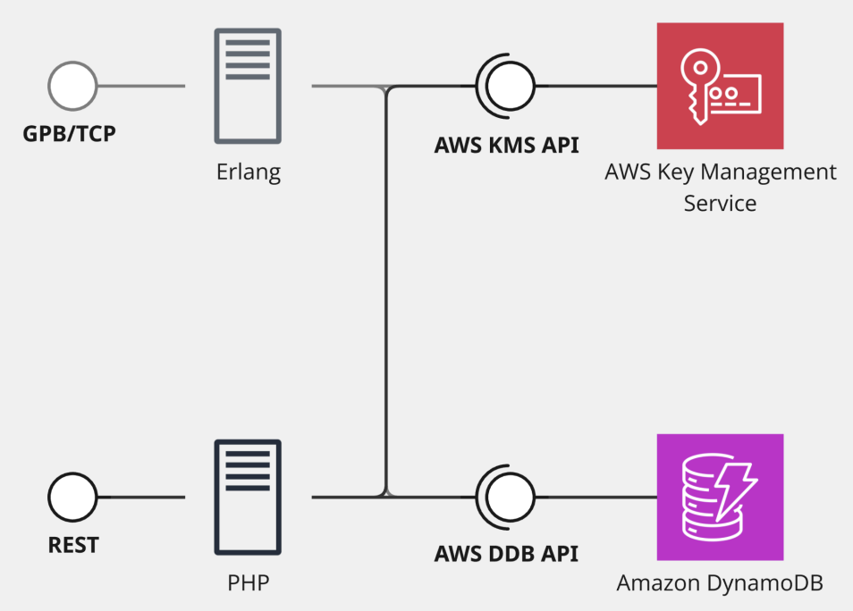

# Hybrid TCP/HTTP System

A distributed application that combines TCP/gRPC and HTTP REST communication to provide a robust and scalable data management solution.

## Architecture

The system consists of two components:

- **TCP Server (Erlang)**: High-performance server using gRPC for efficient communication
- **HTTP REST API (PHP)**: RESTful web interface for client application integration

Besides that:
- **Persistence**: Amazon DynamoDB
- **Security**: Data at rest encrypted with AWS KMS

<br>



## Prerequisites (MacOS)

### For TCP Server (Erlang)
```bash
# Erlang/OTP
brew install erlang

# Rebar3 (build tool)
brew install rebar3
```

### For HTTP API (PHP)
```bash
# PHP
brew install php

# Composer
brew install composer
```

### AWS
```bash
- IAM User
- DynamoDB
- KMS Key

# Resources Creation

This project uses a AWS CloudFormation Template to create the needed resources.

Access your AWS Console and navigate to CloudFormation. There you can upload the template file (cloud_formation.yml) to load all the resources.

Be sure to check the Output section, where you will find the IAM access keys, which will be needed to your application connect to AWS.

AWS_ACCESS_KEY_ID=
AWS_SECRET_ACCESS_KEY=
```
